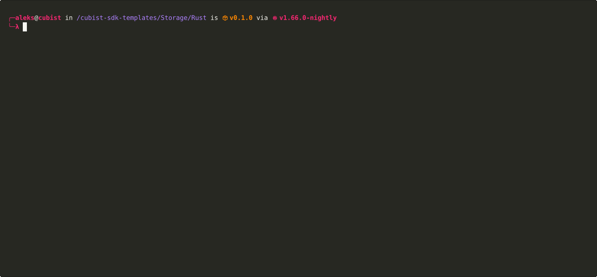

#  Cubist multi-chain and cross-chain SDK

Cubist is an SDK and command line tool for building distributed web3
applications. Cubist's goal is to make testing and development seamless, even
if your dapp runs across multiple chains.

Using our SDK, you write smart contracts as if they're deployed on the same
chain; Cubist automatically generates the tricky (and risky!) bridge code that
allows your smart contracts to interact. 
  

**The SDKs and tools are described in detail on the official [Cubist docs site](https://docs.cubist.dev).**

## Supported chains and languages

Cubist supports off-chain code written in:
- **JavaScript**
- **TypeScript**
- and **Rust**

Cubist supports development and deployment for:
- **Ethereum**
- **Polygon**
- **Avalanche**
- and **Avalanche subnets**

> Support for **more chains** and **more off-chain languages** coming soon!
> If you're interested in a particular chain or language, reach out:
> hello@cubist.dev.

## Repo organization

Cubist is largely implemented in Rust; the TypeScript and JavaScript SDKs are
written in TypeScript. This repo hosts the code for all our crates and
packages, including:

- **cubist-cli**: Cubist CLI tool.
- **cubist-sdk**: Cubist Rust SDK crate.
- **cubist-node-sdk**: Cubist Node.js package.
- **cubist-config**: Cubist configurations shared across the SDKs and CLI tool.
- **cubist-localchains**: Crate for running chains locally.

# License

Copyright (C) 2022-2023 Cubist, Inc.

See the [NOTICE](NOTICE) file for licensing information.
